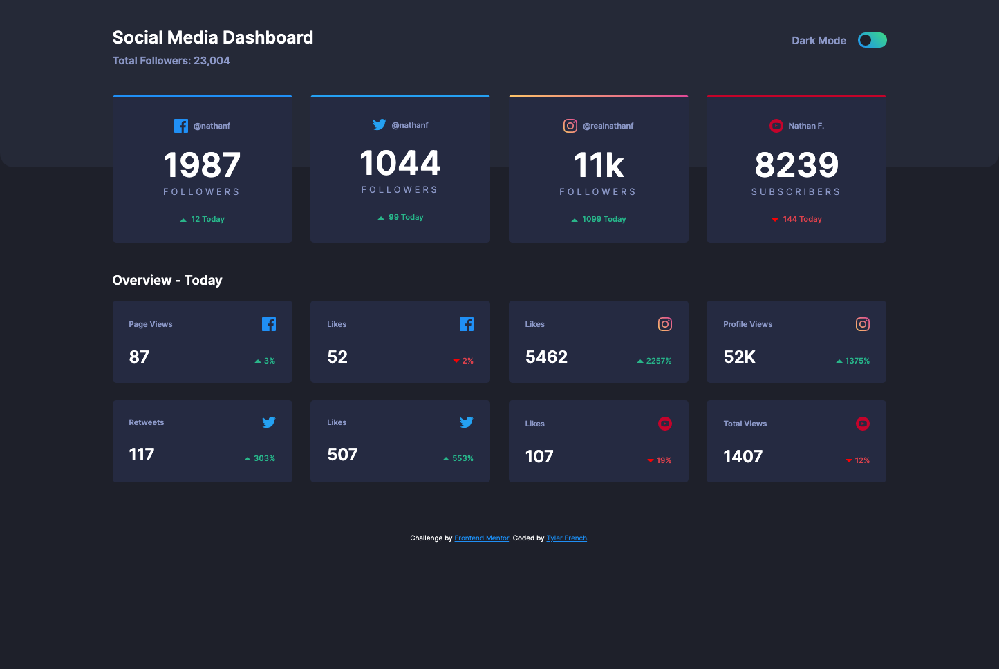
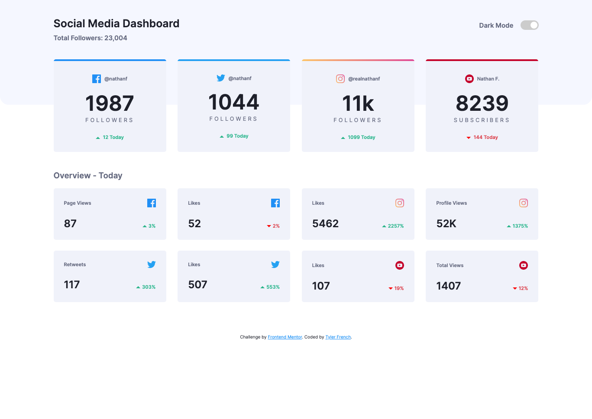

# Frontend Mentor - Social media dashboard with theme switcher solution

This is a solution to the [Social media dashboard with theme switcher challenge on Frontend Mentor](https://www.frontendmentor.io/challenges/social-media-dashboard-with-theme-switcher-6oY8ozp_H). Frontend Mentor challenges help you improve your coding skills by building realistic projects. 

## Table of contents

- [Overview](#overview)
  - [The challenge](#the-challenge)
  - [Screenshot](#screenshot)
  - [Links](#links)
  - [Built with](#built-with)
  - [What I learned](#what-i-learned)
  - [Continued development](#continued-development)
  - [Useful resources](#useful-resources)
- [Author](#author)
- [Acknowledgments](#acknowledgments)

**Note: Delete this note and update the table of contents based on what sections you keep.**

## Overview

### The challenge

Users should be able to:

- View the optimal layout for the site depending on their device's screen size
- See hover states for all interactive elements on the page
- Toggle color theme to their preference

### Screenshot

### Links

- Solution URL: [Add solution URL here](https://drrecommended.github.io/social-dash/)

### Built with

- Semantic HTML5 markup
- Sass
- Flexbox
- Mobile-first workflow

### What I learned

In this exersise I wanted to test my css knowledge while doing a 100-days of code challenge. I learned that all websites are already responsive. I also learned how to emplement light/dark mode with ease using Sass variables.

### Continued development

I would like to learn how to plus my own social media information into this project(not sure if this is possible but will be researching it)

### Useful resources

- [Example resource 1](https://courses.kevinpowell.co/conquering-responsive-layouts) - This helped me really get a grasp with responsive layouts. If anyone out there wants to upgrade their css knowledge I HIGHLY recommended this course. 

## Author

- Website - [Add your name here](https://www.tylerfrenchtech.com)
- Frontend Mentor - [@Drrecommended](https://www.frontendmentor.io/profile/Drrecommended)
- Twitter - [@drrecommendedTF](https://twitter.com/drrecommendedTF)

## Acknowledgments

Shout out to Kevin Powell for the excellent free knowlege online. 
